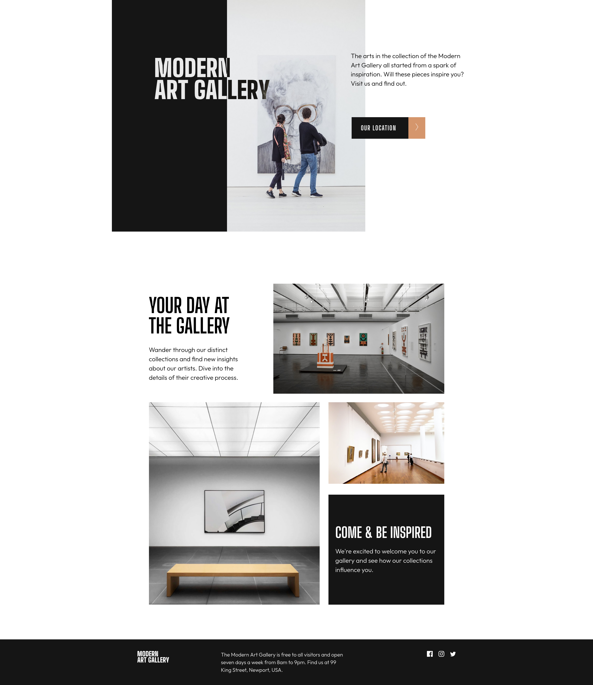
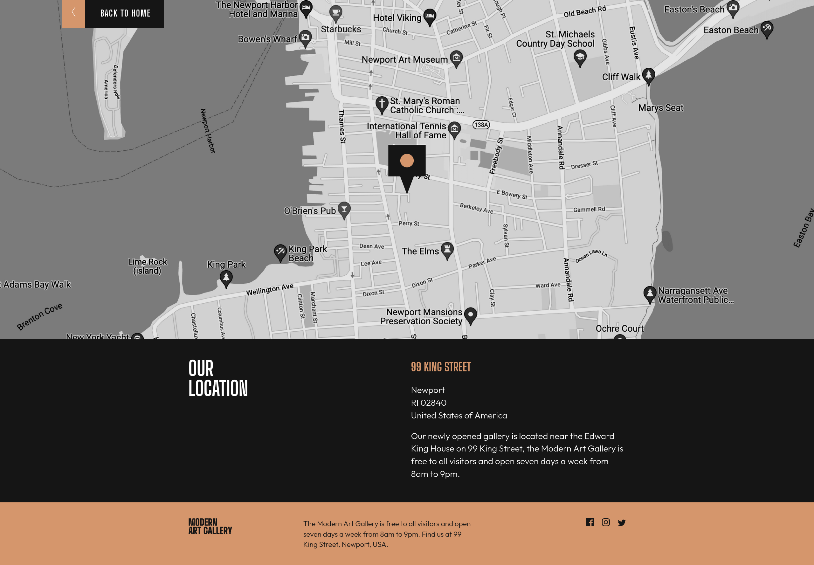
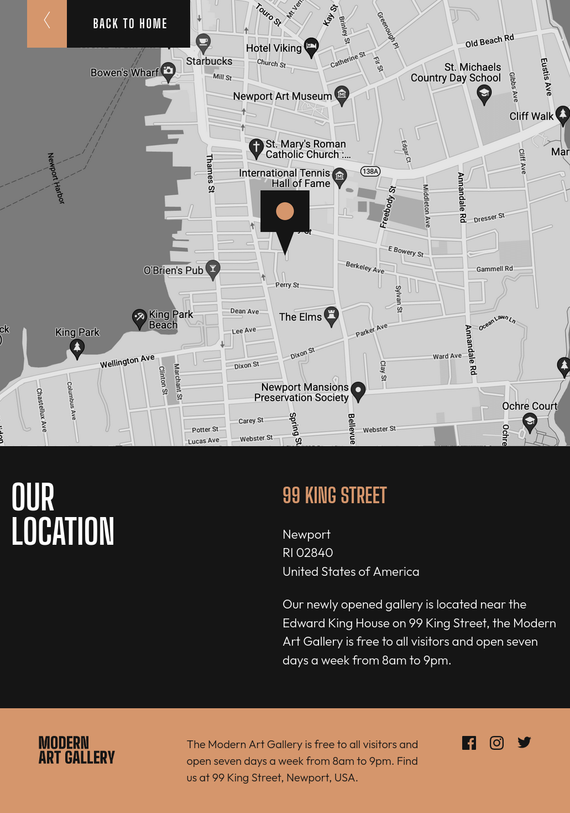
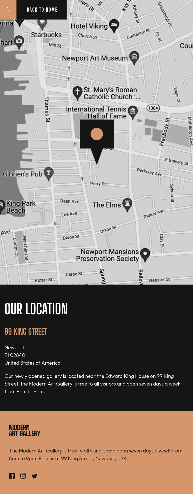

# Frontend Mentor - Art gallery website solution

This is a solution to the [Art gallery website challenge on Frontend Mentor](https://www.frontendmentor.io/challenges/art-gallery-website-yVdrZlxyA). Frontend Mentor challenges help you improve your coding skills by building realistic projects. 

## Table of contents

- [Overview](#overview)
  - [The challenge](#the-challenge)
  - [Screenshot](#screenshot)
  - [Links](#links)
- [My process](#my-process)
  - [Built with](#built-with)
  - [What I learned](#what-i-learned)
  - [Continued development](#continued-development)
  - [Useful resources](#useful-resources)
- [Author](#author)
- [Acknowledgments](#acknowledgments)

## Overview

### The challenge

Users should be able to:

- View the optimal layout for each page depending on their device's screen size
- See hover states for all interactive elements throughout the site
- **Bonus**: Use [Leaflet JS](https://leafletjs.com/) to create an interactive location map with custom location pin

### Screenshot
- 

- 

- 

### Links

- Solution URL: [Github](https://github.com/PRINCEKK122/junior-challenges-frontend-mentor/tree/main/art-gallery-website)
- Live Site URL: [Modern Art Gallery](https://modern-art-gallery-fem.netlify.app/)

## My process

### Built with

- Semantic HTML5 markup
- CSS custom properties
- Flexbox
- CSS Grid
- Mobile-first workflow
- Sass

### What I learned
Adding styles to an svg file was quite tricky, especailly when you want to add the hover state to an svg file and change its' color.

To change the default color of an SVG file, add `fill` attribute to its corresponding `path` HTML tag and set its value to `currentColor`.

```html
<svg width="20" height="17" xmlns="http://www.w3.org/2000/svg">
  <path
    d="M20 2.172a8.192 8.192 0 0 1-2.357.646 4.11 4.11 0 0 0 1.805-2.27 8.22 8.22 0 0 1-2.606.996A4.096 4.096 0 0 0 13.847.248c-2.65 0-4.596 2.472-3.998 5.037A11.648 11.648 0 0 1 1.392 1a4.109 4.109 0 0 0 1.27 5.478 4.086 4.086 0 0 1-1.858-.513c-.045 1.9 1.318 3.679 3.291 4.075a4.113 4.113 0 0 1-1.853.07 4.106 4.106 0 0 0 3.833 2.849A8.25 8.25 0 0 1 0 14.658a11.616 11.616 0 0 0 6.29 1.843c7.618 0 11.923-6.434 11.663-12.205A8.354 8.354 0 0 0 20 2.172Z"
    fill="currentColor" />
</svg>
```

In the CSS, we can now change the color of an SVG element using the normal color property as that of text
```css
svg {
  color: red;
}

svg:hover {
  color: blue;
}
```

### Continued development

In this project, I really learnt how powerful CSS Grid is, and I am beginning to understand its power. When combined with Flexbox, you can create any kind of layout. I will keep on harnessing my skill in CSS Grid and the React Library.

### Useful resources
- [Kevin Powell CSS Grid](https://www.youtube.com/watch?v=rg7Fvvl3taU&t=1782s&pp=ygUVa2V2aW4gcG93ZWxsIGNzcyBncmlk) - It helped me in reordering grid items and how they are presented without changing the markup.

- [HTML and CSS From the Beginning](https://www.udemy.com/course/modern-html-css-from-the-beginning/)

## Author

- Website - [PRINCEKK122](https://github.com/PRINCEKK122)
- Frontend Mentor - [@PRINCEKK122](https://www.frontendmentor.io/profile/PRINCEKK122)


## Acknowledgments
I took my inspiration from a fellow Frontend mentor colleague [@jorahhh](https://www.frontendmentor.io/profile/Jorahhh). Thanks Angelo and I am wishing all the best in your coding journey.
